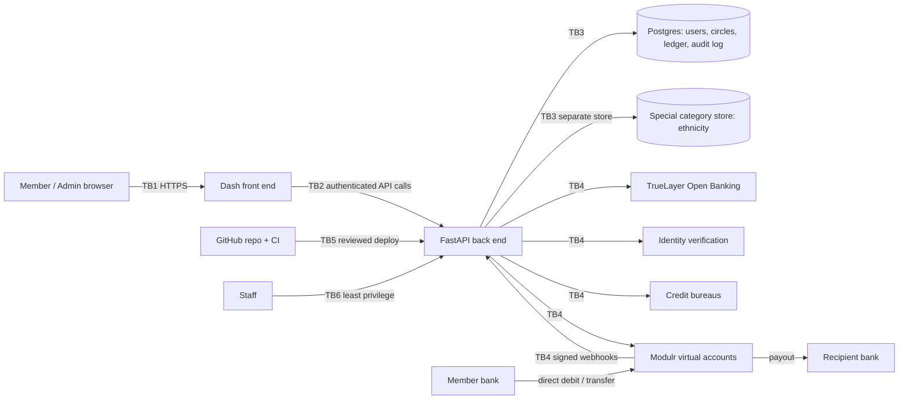

# AjoFinance threat model and security requirements

| | |
|---|---|
| **Owner** | Security |
| **Status** | Draft for review (issue #12, part of #3) |
| **Applies to** | This repository: Dash front end, FastAPI back end, planned partner integrations |
| **Review** | Updated at the start and end of every milestone (see [Review cadence](#9-review-cadence)) |

This document lists what we protect, who might attack it, how, and what we do about it.
Every Security ticket must trace back to a threat (`T-xx`) and a requirement (`SR-xx`) here.
If a ticket has no matching risk, either the ticket is not needed or this document is missing something: update it in the same PR.

> This is a public repository. Never add real secrets, credentials, real personal data or real bank details to this file or its examples.

---

## 1. Scope and assumptions

**In scope**

- The UK product: sign-up, identity verification, Open Banking affordability check, credit score lookup, circles, contributions, payouts, Delay Cover, Early Payout and credit reporting.
- The code in this repository and its build, CI and deployment pipeline.
- How we connect to partners: TrueLayer (Open Banking), Modulr (virtual accounts and payments), identity verification, credit bureaus.

**Out of scope for now**

- Nigeria checks (locked for later; this document must be reviewed before they are built).
- The partners' own internal security. We rely on their regulated status and contracts, but we still treat them as a trust boundary.

**Assumptions**

- Member money never sits in our own bank account. Contributions go into a regulated partner's virtual accounts (Modulr sandbox planned).
- Members never see each other's bank details. They see names and payment status only (the privacy layer).
- The pilot is fee-free. A fee is calculated and shown as waived; £0 is always charged; there are no late fees.
- Affordability in v1 is rules-based. A human reviews every decline.
- Today all partner integrations are dummies. Threats are written for the real versions so we design for them now.

**Where we are today (baseline review, M0)**

- Single-process Plotly Dash app (`app_dash_web.py`, `pages/*.py`) with hardcoded data in `pages/data.py`.
- Sign-in is a mock. The Member/Admin role is a UI toggle that anyone can flip.
- `app.run(debug=True)` is on.
- `api.py` is a FastAPI sign-up/JWT sketch that does not run yet. It hashes passwords with bcrypt (good), but has a hardcoded placeholder JWT signing key (public, so it must be replaced and never reused), 30-day tokens that cannot be revoked, uses python-jose (prefer PyJWT), and the sign-up response reveals whether an email is already registered.
- No `.gitignore`; a `.venv`, a backup tarball and screenshots in `uploads/` are committed. No real secrets were found in the git history.

Nothing from the current code or from M1 is deployed publicly.

---

## 2. Assets

| ID | Asset | Why it matters |
|---|---|---|
| A-01 | Member funds and the Delay Cover reserve pot (held at the partner) | Direct financial loss to members and to us |
| A-02 | Ledger integrity (contributions, payouts, advances, repayments, quotes) | The ledger is the record of who owes what; if it is wrong, money goes to the wrong people |
| A-03 | Personal data: name, contact details, address, date of birth, ID documents and selfies | Identity theft; UK GDPR breach |
| A-04 | Open Banking data and access tokens | Full view of someone's finances; token misuse |
| A-05 | Credit data (scores, bureau reports, what we report back) | Wrong data harms a member's credit file |
| A-06 | Ethnicity answers (UK GDPR special category) | High harm if leaked or misused; discrimination risk |
| A-07 | Credentials, sessions, API keys, signing keys | Key to every other asset |
| A-08 | Audit log | Evidence for disputes, regulators and incident response |
| A-09 | Circle settings and payout order | Changing the order changes who gets paid when |
| A-10 | Fee configuration | Charging a fee could break the fee-free credit exemption |
| A-11 | Trust and reputation in the communities we serve | One fraud or leak can end the product |

---

## 3. Actors

| Actor | Description and motive |
|---|---|
| Honest member | Wants to save and get paid on time. May make mistakes (late payment, typo in bank details). |
| Malicious member | Joins to take an early payout and disappear; uses stolen or synthetic identity; runs several accounts; tries to see other members' data or change amounts. |
| Malicious circle admin | Reorders the queue to benefit themselves or friends; pressures members; tries to see bank details. |
| External attacker | Credential stuffing, account takeover, payout redirection, scraping, exploiting public repo or debug mode. |
| Insider | Developer, support or ops staff with access to production, config or data. May be careless or malicious. |
| Compromised partner or dependency | A breached partner API, a malicious Python package, a compromised CI action. |
| Money launderer | Uses circles and mule accounts to move or clean money. |

---

## 4. Trust boundaries and data flow

Trust boundaries (TB) are where data or control crosses from something we trust less to something we trust more.

- **TB1** Browser ↔ Dash/API: everything from the browser is untrusted, including role, circle ID, amounts and quote values.
- **TB2** Dash ↔ FastAPI: Dash must call the API with an authenticated request (#41); Dash is not trusted to decide permissions.
- **TB3** API ↔ Postgres: only the API talks to the database; the ledger is append-only.
- **TB4** API ↔ partners (TrueLayer, Modulr, ID verification, bureaus): partner responses are validated; webhooks are signed and checked.
- **TB5** CI/CD and config ↔ production: only reviewed code and config reach production; secrets come from the environment.
- **TB6** Staff/admin tools ↔ production data: least privilege, logged.

---

## 5. Threats

Likelihood and impact are **H**igh, **M**edium or **L**ow, judged for the live product (not the current prototype). STRIDE: **S**poofing, **T**ampering, **R**epudiation, **I**nformation disclosure, **D**enial of service, **E**levation of privilege.

| ID | STRIDE | Threat | Impact | Likelihood | Mitigation | Requirements | Milestone / ticket |
|---|---|---|---|---|---|---|---|
| T-01 | S, T | **Early payout and vanish**: a member takes an early or first-position payout and stops paying | H | H | Early payout capped by amount already paid in; affordability band and max contribution; ID verification; Delay Cover recovery via next cycle or DD retry; credit reporting of missed payments | SR-30, SR-32, SR-21, SR-29 | M3 #52, M5 #60, M6 #61 |
| T-02 | S | **Synthetic or stolen identity** used to sign up | H | M | Identity verification before joining a circle; Open Banking account holder name must match verified identity | SR-20, SR-21 | M3 #50, #43 |
| T-03 | S | **One person, many accounts** to hold several queue positions or bypass limits | H | M | Flag shared identity, device, bank account or Open Banking account; limits apply per verified person | SR-22 | M3 #50, #43 |
| T-04 | S, E | **Account takeover** via phishing, reused passwords or session theft | H | M | Strong password hashing; rate limits and lockout; short sessions; step-up auth for sensitive actions | SR-10, SR-11, SR-12, SR-13 | M2 #33, #40 |
| T-05 | T | **Payout redirection**: attacker (or takeover) changes the payout bank account | H | M | Step-up auth plus cooling-off period for destination changes; notify the member on old and new channels; audit log | SR-26 | M4 #53 |
| T-06 | T, E | **Admin queue manipulation**: admin moves self or friends up after money is in | H | M | Free reorder only before first contribution; after that, swaps need affected members' in-app acceptance; admin never self-promotes without consent; every change audit-logged; settings locked once started | SR-24, SR-25, SR-16 | M4 #49, #42; M2 #32 |
| T-07 | T | **Quote tampering**: client changes the early payout amount or fee | H | M | Quote calculated on the server only; client sends quote ID, not amounts; accept only the exact stored quote | SR-31 | M6 #64, #57, #61 |
| T-08 | T, R | **Quote replay or double-submit**: an old quote is reused, or the accept button is pressed twice | H | M | Quotes expire and are single-use; idempotency key on accept; database uniqueness constraint | SR-31, SR-32 | M6 #61; M5 #58 |
| T-09 | T | **Ledger tampering or imbalance**: bugs or edits make balances wrong | H | M | Append-only, double-entry ledger; no updates or deletes; balance check in CI and scheduled job; reconciliation with partner statements | SR-17, SR-18 | M2 #37, #39 |
| T-10 | I, E | **IDOR / broken access control across circles**: changing a circle or member ID in a request shows or changes another circle | H | H | Server-side per-circle roles checked on every request; deny by default; tests for cross-circle access | SR-14, SR-15 | M2 #38, #41; M1 #23 |
| T-11 | E | **Role toggle or stub login in production**: today anyone can flip to Admin; M1 `admintest`/`membertest` stub must never ship | H | H (today) | Remove toggle (M1); stub login only when running locally and build fails otherwise; nothing from M1 deployed publicly; replaced by real sign-in in M2 | SR-05, SR-06 | M1 #20; M2 #33 |
| T-12 | T, E | **Test-only clock enabled in production**: attacker moves time to expire quotes or trigger payouts | H | L | Test clock hard-disabled in production config; startup check refuses to start if enabled | SR-07 | M2 #36 |
| T-13 | I | **Secrets leaked in the public repo** (keys, tokens, `.env`, backups) | H | M | Secrets from environment only; `.gitignore`; secret scanning, push protection and CI secret scan; rotate anything ever committed | SR-01, SR-02, SR-03 | M0 #10, #11, #15 |
| T-14 | I, E | **Debug mode in production** exposes code, stack traces and an interactive debugger | H | M | Debug off unless explicitly local; startup check | SR-04 | M0 #10 |
| T-15 | S, E | **Token weaknesses**: public placeholder signing key, 30-day non-revocable tokens, weak library | H | M | New random key from environment, never reused; short-lived sessions with server-side revocation; PyJWT with fixed algorithm | SR-01, SR-12 | M0 #10; M2 #33 |
| T-16 | I | **User enumeration**: sign-up or sign-in reveals whether an email is registered | M | H | Same response and similar timing for known and unknown emails; send "you already have an account" by email instead | SR-13 | M2 #33 |
| T-17 | S, D | **Brute force and credential stuffing** on sign-in | H | H | Rate limit per IP and per account; progressive lockout; breached-password check | SR-11 | M2 #40 |
| T-18 | T, R | **AML / mule accounts**: circles used to move criminal money | H | M | Payments only through the regulated partner, who runs AML checks; ID verification; flag unusual patterns (many circles, fast in/out, mismatched names) and escalate to partner | SR-20, SR-22, SR-27 | M3 #50; M4 #51 |
| T-19 | I | **Bank details leak to other members** through UI, API responses or exports | H | M | Privacy layer: API returns names and payment status only; virtual accounts so no member bank details are shared; tests check responses | SR-23 | M4 #48, #51 |
| T-20 | I, E | **Special category data misuse**: ethnicity used in affordability or pricing, or leaked | H | L | Optional with explicit consent; stored separately with separate access; never an input to affordability, limits or pricing (enforced in code and tests); reported only in aggregate | SR-08 | M2 #34 |
| T-21 | I | **Open Banking token theft** from database, logs or backups | H | M | Tokens encrypted at rest with keys outside the database; least scope and shortest consent; store band and reasons, not raw transactions | SR-19, SR-21 | M3 #43, #52 |
| T-22 | T, E | **Fee switch misuse** turns on charging and could break the fee-free credit exemption | H | L | Fee always £0 in pilot; fee switch only via reviewed config change in a PR, logged; no admin screen can change it; legal check gate before any change | SR-28 | M5 #63; M6 #64, #57; Gate #59 |
| T-23 | T, E | **Dependency or supply chain compromise** (malicious package, unpinned versions, compromised CI action) | H | M | Pinned requirements; Dependabot alerts; review new dependencies; pin CI actions; `security-review` label | SR-03, SR-34 | M0 #9, #15 |
| T-24 | I | **Personal data in logs**, error reports or screenshots (`uploads/`) | M | H | Do not log PII, tokens or bank details; redact in error handlers; check and remove committed screenshots; synthetic personas only, git-ignored | SR-09, SR-02 | M0 #13; M1 #16 |
| T-25 | R | **Repudiation**: admin or member denies making a change or accepting a quote | M | M | Append-only audit log with who, what, when, before and after; quotes and acceptances recorded | SR-16, SR-31 | M2 #32; M6 #57 |
| T-26 | T, E | **Circle settings changed after start** (amount, frequency, members) | H | M | Lock settings once the first contribution is made; changes need a new circle or all-member consent | SR-24 | M4 #42 |
| T-27 | T, D | **Delay Cover abuse**: members repeatedly pay late to use the reserve as free credit, draining it | H | M | Server-side advance limits per member and per circle; repayment through next cycle or DD retry; double-submit protection | SR-29 | M5 #58, #60, #63 |
| T-28 | S, T | **Forged partner webhooks** mark contributions as paid | H | L | Verify webhook signatures; reconcile with partner API before crediting ledger | SR-27 | M4 #51 |
| T-29 | T, I | **Wrong or leaked credit data** reported to bureaus | H | L | Report only completed, reconciled cycles; member can see what we report; dispute process | SR-33 | M7 #56; Gate #66 |
| T-30 | E, I | **Insider misuse** of production data or config | H | L | Least privilege; no shared accounts; production data access logged; no real data in dev or test | SR-35, SR-09 | M2 onwards |
| T-31 | S, D | **Automated decisions harm members** (unfair decline with no human) | M | M | Human review for every affordability decline; clear reasons; route to appeal | SR-21 | M3 #52 |
| T-32 | T, R | **Paid-then-leave**: a member who has already received their payout leaves, stops contributing or is replaced, leaving the circle short | H | M | Exit after payout keeps the remaining contributions owed (direct debit continues, or Delay Cover covers and the debt is recovered); a replacement takes over only unpaid positions and never receives a payout already made; every exit and replacement is recorded in the ledger and audit log | SR-36, SR-24, SR-16 | M4 #47; M5 #63 |

---

## 6. Security requirements

Each requirement is testable. "Must" means the milestone is not done without it.

### M0 Clean-up and safety

- **SR-01** Secrets (JWT signing key, API keys, database URLs) must come from environment variables or a secrets manager, never from code. The placeholder JWT key in `api.py` is public and must never be used in any environment. (T-13, T-15; #10)
- **SR-02** A `.gitignore` must exclude `.venv`, caches, `.env*`, backups, build output and local data; committed copies must be removed. Screenshots in `uploads/` must be checked for personal data and removed if any is found. (T-13, T-24; #11, #13)
- **SR-03** Secret scanning and push protection must be on; Dependabot alerts must be on; CI must run a secret scan on every PR. Any secret ever committed must be treated as leaked and rotated. (T-13, T-23; #15)
- **SR-04** Debug mode must be off unless an explicit local-only setting is set; the app must refuse to start with debug on in any non-local environment. (T-14; #10)

### M1 Frontend roles and UI

- **SR-05** The UI role toggle must be removed. Role-based visibility is tested for both roles. (T-11; #20, #23)
- **SR-06** The `admintest`/`membertest` stub login must only work when running locally, and the build must fail if it is enabled anywhere else. Nothing from M1 is deployed publicly. Dummy personas are synthetic and live in a git-ignored file. (T-11, T-24; #20, #16)

### M2 Foundations

- **SR-07** The test-only clock must be impossible to enable in production; the app must refuse to start if it is. (T-12; #36)
- **SR-08** The ethnicity question must be optional, with explicit consent and a clear purpose; answers stored separately from other user data with separate access; never read by affordability, limits or pricing code (a test enforces this); used only in aggregate. (T-20; #34)
- **SR-09** Logs, error reports and analytics must not contain passwords, tokens, full bank details, ID document data, Open Banking data or ethnicity. Real personal data must never be used outside production. (T-24, T-30)
- **SR-10** Passwords must be hashed with bcrypt or Argon2 and a minimum strength policy, with a breached-password check. (T-04; #33)
- **SR-11** Sign-in must be rate limited per IP and per account, with progressive lockout and member notification. (T-17; #40)
- **SR-12** Sessions must be short-lived (access token minutes, not days), revocable on the server (sign-out, password change, suspected takeover) and signed with PyJWT using a fixed algorithm. (T-04, T-15; #33)
- **SR-13** Sign-up, sign-in and password reset must not reveal whether an email is registered. (T-16; #33)
- **SR-14** Every API request must check, on the server, that the caller is signed in and has the right role in that specific circle. Default is deny. The client never sends its own role. (T-10; #38, #41)
- **SR-15** Automated tests must prove a member of one circle cannot read or change another circle's data by changing IDs. (T-10; #38)
- **SR-16** An append-only audit log must record role changes, position changes, settings changes, payout destination changes, quote acceptances and fee config changes: who, what, when, before and after. Normal users and admins cannot edit or delete it. (T-06, T-25; #32)
- **SR-17** The ledger must be append-only and double-entry; corrections are new entries, never edits or deletes. (T-09; #37)
- **SR-18** CI must check that the ledger balances for seeded test circles; production must run a scheduled balance and partner reconciliation check that alerts on mismatch. (T-09; #39)

### M3 UK due diligence

- **SR-19** Open Banking tokens must be encrypted at rest with keys held outside the database, requested with the least scope, and deleted when consent ends. (T-21; #43)
- **SR-20** Identity must be verified before a member can join a circle or receive money. (T-02, T-18; #50)
- **SR-21** Affordability must store the band, maximum contribution and reasons, not raw transactions. Every decline must be reviewed by a person, and the member told the reason and how to ask for review. (T-01, T-21, T-31; #52)
- **SR-22** The system must flag when one person appears to hold several accounts (same verified identity, bank account, Open Banking account or device) and apply limits per person. (T-03, T-18; #50, #43)

### M4 Circles and money flows

- **SR-23** API responses to members must contain other members' names and payment status only; never bank details, contact details or ID data. Members pay into partner virtual accounts. (T-19; #48, #51)
- **SR-24** Circle settings (amount, frequency, size) must lock once the first contribution is made. Locking the size still allows a leaving member to be replaced through the exit and replacement flow (#47), which keeps the size the same. (T-06, T-26, T-32; #42, #47)
- **SR-25** Before the first contribution, the admin may reorder freely. After it, any swap needs in-app acceptance from every affected member; the admin can never move themselves up without consent. All changes are audit-logged. (T-06; #49)
- **SR-26** Changing a payout destination must need step-up authentication and a cooling-off period, notify the member, and be audit-logged. Payouts during the cooling-off period go to the previous verified account. (T-05; #53)
- **SR-27** Payments must go only through the regulated partner. Partner webhooks must be signature-checked and reconciled before the ledger is credited. Suspicious patterns are escalated to the partner's AML process. (T-18, T-28; #51)
- **SR-28** The fee must be calculated and shown as waived, and £0 charged, with no late fees. The fee switch can only change through a reviewed config change in a PR, is logged, and has no admin screen. Any change needs the legal check gate (#59). (T-22; #63, #64, #57)

### M5 Delay Cover

- **SR-29** Delay Cover advance limits must be enforced on the server per member and per circle, with double-submit protection; repayment through the next cycle or a direct debit retry. (T-01, T-27; #58, #60, #63)

### M6 Early Payout

- **SR-30** An early payout must be capped by the amount the member has already paid in. (T-01; #61)
- **SR-31** Quotes must be calculated only on the server from queue position; stored with an ID and expiry; single-use. Acceptance sends only the quote ID and must match the exact quote shown; expired or changed quotes are rejected. (T-07, T-08, T-25; #64, #57)
- **SR-32** Accepting a quote must be idempotent (idempotency key plus a database constraint) so a double press pays once. (T-08; #61)

### M7 Credit reporting

- **SR-33** Only completed, reconciled cycles are reported to bureaus; members can see what is reported and dispute it. (T-29; #56)

### All milestones

- **SR-34** New or upgraded dependencies must be pinned and reviewed; CI actions pinned to a version or commit. (T-23; #9, #15)
- **SR-35** Production access must be least privilege, named accounts only, logged, and reviewed each milestone. (T-30)
- **SR-36** Member exit and replacement must keep the ledger balanced. A member who has already been paid stays liable for their remaining contributions, and a replacement can only take over unpaid positions. Every exit and replacement needs the admin's action and the affected members' acceptance, and is audit-logged. (T-32; #47)

---

## 7. Regulatory and compliance notes

> **Not legal advice.** These notes help the team ask the right questions. Decisions must be confirmed by qualified legal and compliance advisers before go-live.

- **UK GDPR and DPIA.** We process ID documents, financial data and (optionally) ethnicity, a special category. A Data Protection Impact Assessment is a go-live gate (#65). Collect only what we need, set retention periods, and support access and deletion requests.
- **Special category data (ethnicity).** Needs explicit consent and an Article 9 condition; kept separate; never used in decisions about a member (SR-08).
- **Article 22 (automated decisions).** Affordability decisions can significantly affect people. v1 has human review for declines, and we explain reasons and offer review (SR-21).
- **FCA Consumer Duty.** Clear communication, fair value, avoid foreseeable harm, and support for members in vulnerable circumstances, especially for Delay Cover and Early Payout.
- **Consumer credit.** Delay Cover and Early Payout may be credit. The pilot relies on a fee-free credit exemption, which is **pending a legal check** (gate #59). Until then, the fee stays £0 and cannot be switched on (SR-28).
- **AML and payments.** Funds are held and moved by a regulated partner (Modulr, gate #62), which carries out AML checks. We still verify identity, flag suspicious patterns and pass concerns to the partner.
- **Credit reporting.** Needs a signed agreement with the bureau (gate #66) and accurate data (SR-33).

---

## 8. PR security review rule

Any PR that touches **authentication, sessions, roles or permissions, money (ledger, payments, payouts, quotes, fees, Delay Cover), personal or special category data, partner integrations, secrets or config, or dependencies** must:

1. Have the `security-review` label.
2. Say in the description which `T-xx` and `SR-xx` it relates to.
3. Get approval from Security before merge.

New Security tickets must name the threat they address. If none fits, add a threat here in the same PR.

---

## 9. Review cadence

- Review this document at the start of each milestone (add new threats) and before it closes (check requirements are met).
- Review straight away after any security incident, new partner, new feature that moves money, or the Nigeria work starting.
- Changes go through a PR with the `security-review` label and Security sign-off.

## 10. Security ticket traceability

| Ticket | Threats | Requirements |
|---|---|---|
| #10 Secrets from env, JWT placeholder, debug off | T-13, T-14, T-15 | SR-01, SR-04 |
| #12 This document | All | All |
| #13 Screenshots in `uploads/` | T-24 | SR-02, SR-09 |
| #15 Secret scanning, Dependabot, CI scan | T-13, T-23 | SR-03, SR-34 |
| #32 Audit log | T-06, T-25 | SR-16 |
| #40 Rate limits and lockout | T-04, T-17 | SR-11 |
| #42 Lock circle settings | T-06, T-26 | SR-24 |
| #53 Payout destination verification and waiting period | T-05 | SR-26 |
| #58 Delay Cover limits and double-submit | T-27, T-08 | SR-29 |
| #61 Early Payout cap and double-submit | T-01, T-08 | SR-30, SR-32 |
